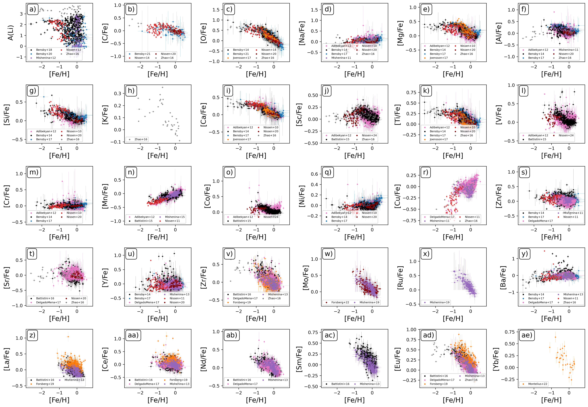

# *cya_easier* Compare Your Abundances Easier!

**Github Repository:** https://www.github.com/svenbuder/cya_easier
**Author:** Sven Buder (ANU, sven.buder@anu.edu.au) for this Github Repository. Literature data from the respective sources (cite them!)

If this is not enough information for you, also check out the [Hypatia catalag](http://hypatiacatalog.com) by [Hinkel et al. (2014)](http://adsabs.harvard.edu/abs/2014AJ....148...54H).

### Directory structure
```plaintext
nihao_simulation_analysis/
├── cya_easier.ipynb                -> Your script if you want to compare your abundances with the literature
├── create_cya.ipynb                -> My script to read in the raw literature files and homogenise their keywords + data
├── literature_bibtex.bib           -> LaTeX bibliography style of all used literature, for easier citation
├── literature_raw_files/           -> Literature files as typically downloaded from the VizieR (some files needed to be merged and adjusted)
├── literature_abundances/          -> Homogenised files, sorted into individual elements
|  ├── Li/                          -> individual homogenised FITS files for Li
|  ├── C/                           -> individual homogenised FITS files for C
|  └── .../                         -> ...
└── figures/                        -> figure output directory for cya_easier.ipynb
```

### Overview of available abundance measurements


